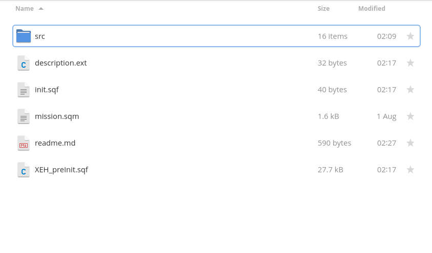

# SESO Mission Framework
## Instructions for Installation:

1. Run and load up Arma 3 >> Eden Editor >> Pick Any Map
1. Save your mission with Scenario >> Save as.. >> MPMissions Folder

Note: UNCHECK Binarize the Scenario File

3. Open the mission directory by going to `C:/users/<your username>/Documents/Arma 3 - Other Profiles/<your arma 3 name>/mpmissions/<mission name>`
1. Note: If the folder has a file inside called mission.sqm then it is a mission directory.
1. Download or clone `SESO-mission-framework` onto your computer
1. Extract the contents to your mission directory (where `mission.sqm` lives) so that the `mission.sqm` and `init.sqf` are visible in the same folder.
1. (Re)load the mission
1. Check Addon Options >> SESO Mission Framework exists. If it exists, you installed the framework correctly.

It should look like this if you did it right:

## Q.O.L. Scripts + Functions

Used by S.E.S.O. operation hosts.

Modifies multiple scripts and functions found on Bohemia Forums. Below are credits and sources for the scripts.

* [HALs_Store](https://github.com/HallyG/HALs_Store)
* [Simple Convoy Script](https://forums.bohemia.net/forums/topic/226608-simple-convoy-script-release)
* [ZBE_Cache AI](https://forums.bohemia.net/forums/topic/169772-zbe_cache-ai-vehicle-caching-scriptaddon/)
* [Simple Conversation System](https://forums.bohemia.net/forums/topic/165511-spin-off-release-simple-conversation-system/)
